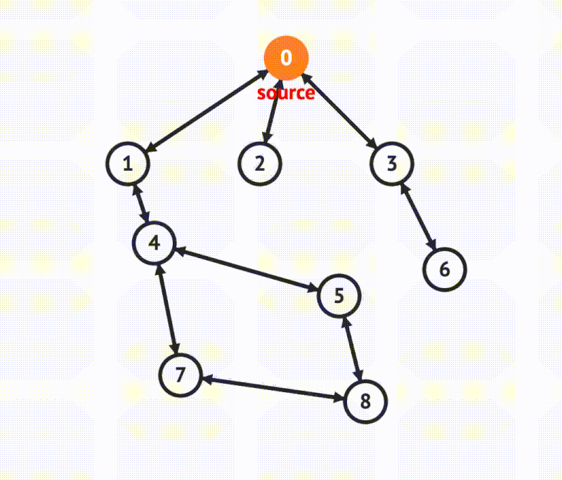

# 🌳 Depth-First Search (DFS)

## 🖼️ Visual Representation

)


## 🐍 Python Code
### DFS for a Graph (Recursive):
```python
def dfs_recursive(graph, node, visited=None, result=None):
    if visited is None:
        visited = set()
    if result is None:
        result = []

    if node not in visited:
        visited.add(node)
        result.append(node)
        for neighbor in graph[node]:
            dfs_recursive(graph, neighbor, visited, result)
    return result

# Example usage:
graph = {
    'A': ['B', 'C'],
    'B': ['D', 'E'],
    'C': ['F'],
    'D': [],
    'E': ['F'],
    'F': []
}
print(dfs_recursive(graph, 'A'))  # Output: ['A', 'B', 'D', 'E', 'F', 'C']
````


## 🔑 Key Features

* **Type**: Graph traversal algorithm.
* **Works With**: Directed/Undirected Graphs, Trees.
* **Time Complexity**: $O(V + E)$, where $V$ is vertices and $E$ is edges.
* **Space Complexity**:

  * Recursive: $O(V)$ (call stack).
  * Iterative: $O(V)$ (explicit stack).

## ⚙️ Algorithm Steps

1. **Recursive DFS**:

   * Start at the initial node.
   * Visit the current node and mark it as visited.
   * Recur for all its unvisited neighbors.
2. **Iterative DFS**:

   * Use a stack instead of recursion.
   * Pop nodes from the stack, visit them, and push their unvisited neighbors.

## 🛠️ Applications

* **Topological Sorting**: In directed acyclic graphs.
* **Cycle Detection**: Identifying cycles in graphs.
* **Pathfinding**: Exploring paths in mazes or puzzles.
* **Connected Components**: Identifying components in a graph.
