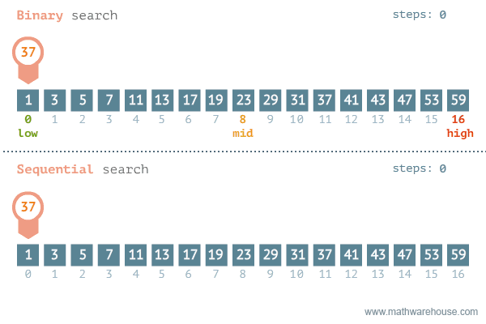

# 🔍 Linear Search vs Binary Search

## 🖼️ Visual Representation

### Linear vs Binary Search:




## 🐍 Python Code
### Linear Search:
```python
def linear_search(array, target):
    for i, value in enumerate(array):
        if value == target:
            return i
    return -1
````

### Binary Search:

```python
def binary_search(array, target):
    low, high = 0, len(array) - 1
    while low <= high:
        mid = (low + high) // 2
        if array[mid] == target:
            return mid
        elif array[mid] < target:
            low = mid + 1
        else:
            high = mid - 1
    return -1
```

## 🔑 Key Features

| Feature               | Linear Search            | Binary Search           |
| --------------------- | ------------------------ | ----------------------- |
| **Input Requirement** | Works on unsorted arrays | Requires sorted arrays  |
| **Time Complexity**   | $O(n)$                   | $O(\log n)$             |
| **Space Complexity**  | $O(1)$                   | $O(1)$                  |
| **Best Case**         | $O(1)$ (target at start) | $O(1)$ (middle element) |
| **Worst Case**        | $O(n)$                   | $O(\log n)$             |

## ⚙️ Algorithm Steps

### Linear Search:

1. Start from the first element.
2. Compare each element with the target.
3. Return the index if found, else return -1.

### Binary Search:

1. Start with the middle element of the array.
2. If the target matches the middle, return the index.
3. If the target is smaller, search the left subarray.
4. If the target is larger, search the right subarray.
5. Repeat until the element is found or the array is exhausted.

## 📊 Comparison

* **Linear Search** is simpler and works with unsorted data but is slower for large datasets.
* **Binary Search** is faster but requires a sorted array upfront.
