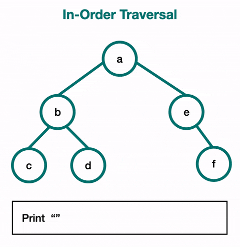

# 🌿 In-Order Traversal (DFS)

## 🖼️ Visual Representation


## 🐍 Python Code
### Recursive Implementation:
```python
def in_order_recursive(node, result=None):
    if result is None:
        result = []
    if node:
        in_order_recursive(node.left, result)
        result.append(node.value)
        in_order_recursive(node.right, result)
    return result

# Example usage:
class Node:
    def __init__(self, value):
        self.value = value
        self.left = None
        self.right = None

# Tree structure:
#       A
#      / \
#     B   C
#    / \
#   D   E
root = Node('A')
root.left = Node('B')
root.right = Node('C')
root.left.left = Node('D')
root.left.right = Node('E')

print(in_order_recursive(root))  # Output: ['D', 'B', 'E', 'A', 'C']
````

## 🔑 Key Features

* **Type**: Depth-First Traversal.
* **Order**: Left → Root → Right.
* **Time Complexity**: $O(n)$, where $n$ is the number of nodes.
* **Space Complexity**: $O(h)$, where $h$ is the height of the tree

## ⚙️ Algorithm Steps

1. Traverse the left subtree recursively.
2. Visit the current node (root).
3. Traverse the right subtree recursively.

## 🛠️ Applications

* **Sorting**: For binary search trees (BST), in-order traversal gives a sorted order of elements.
* **Expression Trees**: Recovers infix expressions.
