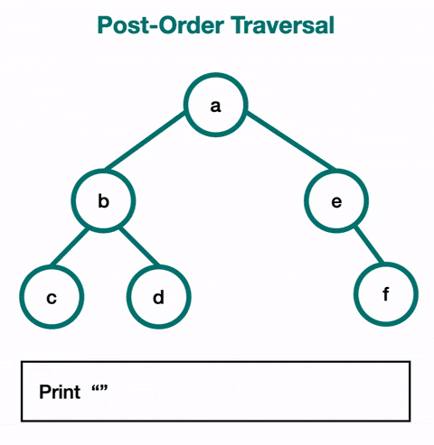

# 🌲 Post-Order Traversal (DFS)

## 🖼️ Visual Representation




## 🐍 Python Code
### Recursive Implementation:
```python
def post_order_recursive(node, result=None):
    if result is None:
        result = []
    if node:
        post_order_recursive(node.left, result)
        post_order_recursive(node.right, result)
        result.append(node.value)
    return result

# Example usage:
class Node:
    def __init__(self, value):
        self.value = value
        self.left = None
        self.right = None

# Tree structure:
#       A
#      / \
#     B   C
#    / \
#   D   E
root = Node('A')
root.left = Node('B')
root.right = Node('C')
root.left.left = Node('D')
root.left.right = Node('E')

print(post_order_recursive(root))  # Output: ['D', 'E', 'B', 'C', 'A']
````

## 🔑 Key Features

* **Type**: Depth-First Traversal.
* **Order**: Left → Right → Root.
* **Time Complexity**: $O(n)$, where $n$ is the number of nodes.
* **Space Complexity**: $O(h)$, where $h$ is the height of the tree (recursive stack or explicit stack).

## ⚙️ Algorithm Steps

1. Traverse the left subtree recursively.
2. Traverse the right subtree recursively.
3. Visit the current node (root).

## 🛠️ Applications

* **Expression Trees**: Recovers postfix expressions.
* **Tree Deletion**: Deletes nodes in a bottom-up manner.
* **Dependency Resolution**: Useful in scenarios where dependencies must be resolved before the dependent.
